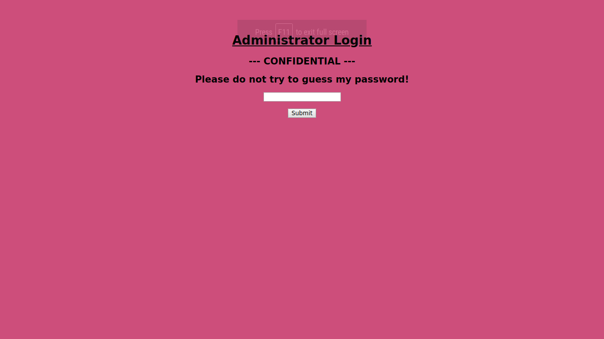

# WEB Challenge - Lernaean - 20 point
Simply we started by login screen belove

So the hint was don't guess the password. So obviously fire up hydra as 
```
hydra -l admin -P rockyou.txt -s 40925 159.65.208.41 http-post-form '/:password=^PASS^:F=Invalid' -V
```
-l option sets username is constant
-P option sets passwords are taken from rockyou.txt
-s option sets the web port which is 40925
and the IP address of the web is followed by service of hydra and last the pattern.
Understanding the pattern took me while. Hydra pattern takes 3 parameters not to be null.
Parameters must be seperated by ```:```
First parameter is login URL which is ```/``` in our case,
second parameter is password the ```^PASS^``` is neccessary
lastly ```F=Invalid``` is the invalid response of wrong credential. So that Hydra can recognize authentication is failed or not.
After brute forcing you'll get the valid password

After successful login catch the request in burp so you can see that the after login the page responds with flag with 302.
